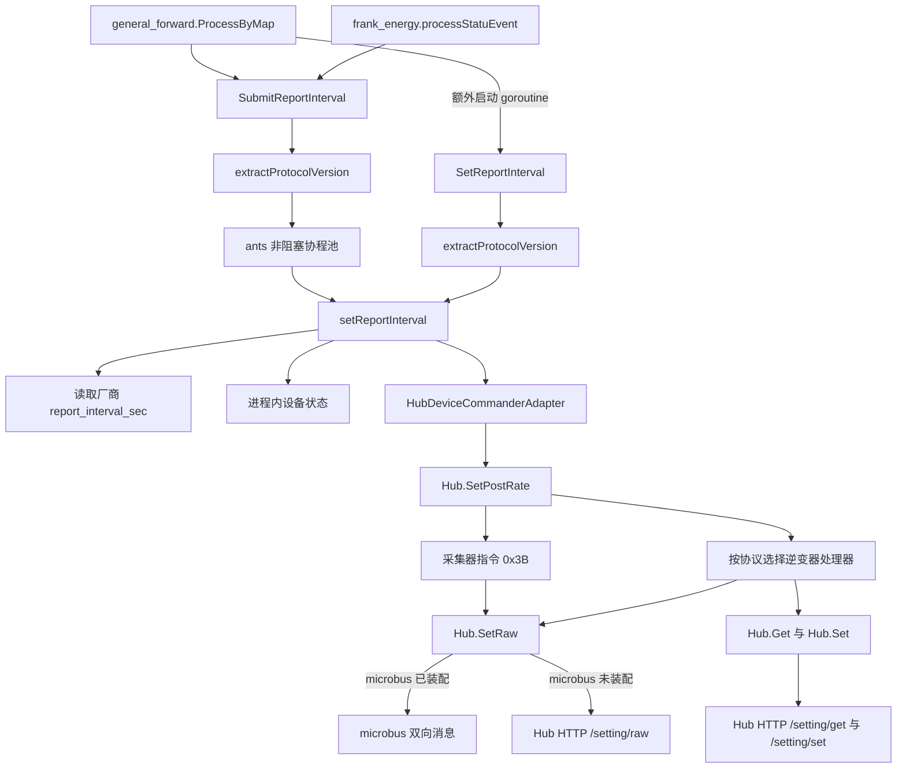
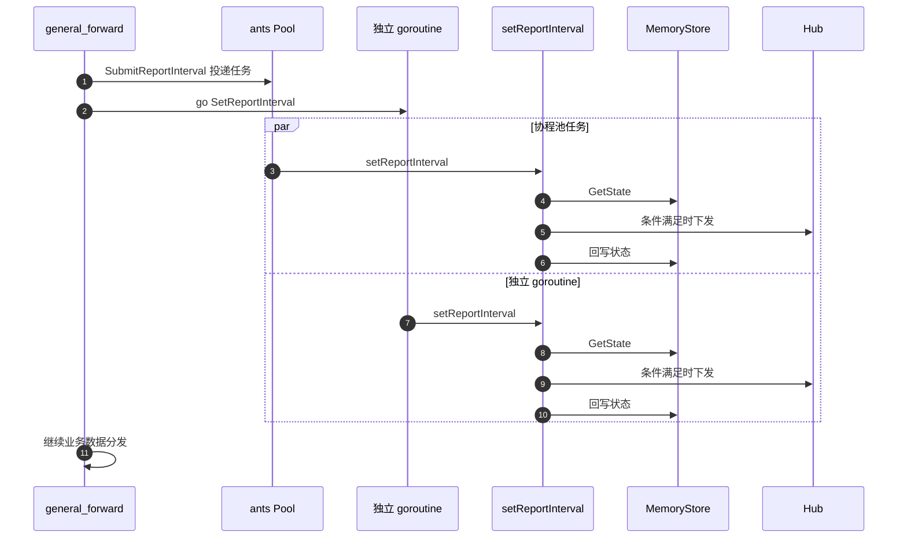
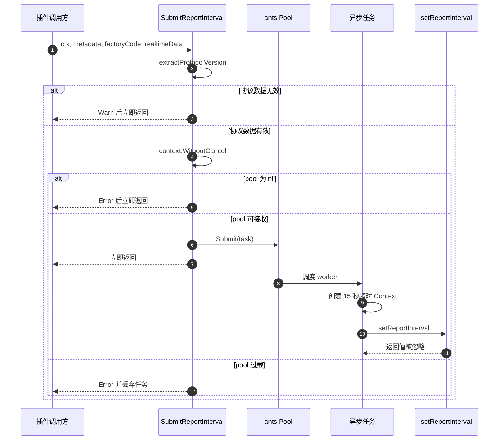
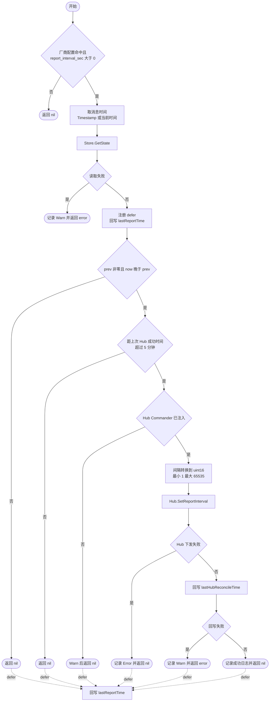
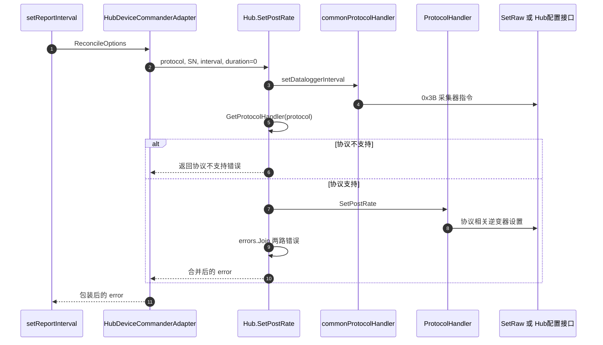
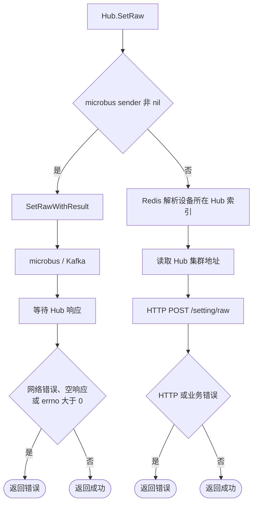
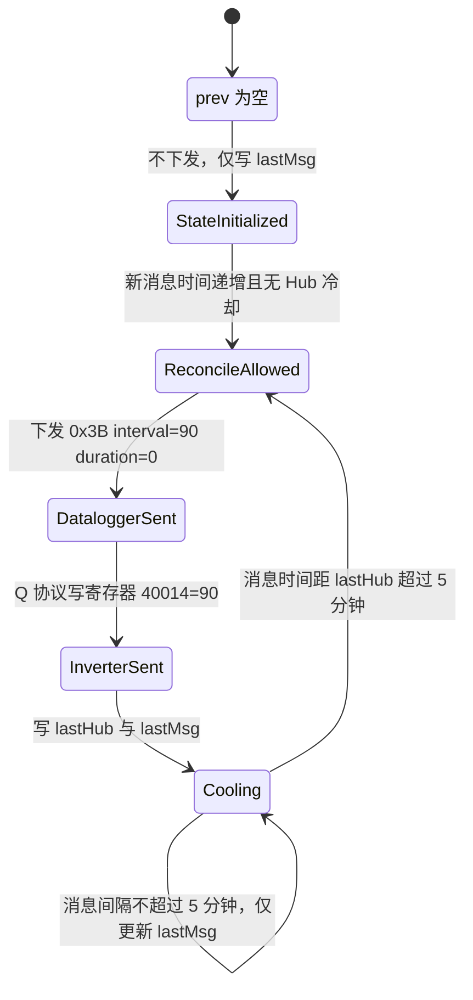
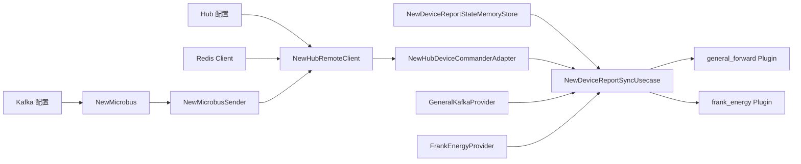

# `SubmitReportInterval` 及下游链路解析

> 本文基于当前仓库代码解释实际运行链路，不代表目标设计，也不包含代码修改。

## 1. 核心结论

`SubmitReportInterval` 是设备上报间隔纠偏的异步入口。它先从实时数据中提取协议首字节，再把任务投递到容量为 2048 的非阻塞 `ants` 协程池。异步任务读取厂商配置和设备进程内状态；满足“功能已启用、不是首条或乱序消息、已超过 5 分钟 Hub 冷却窗口”等条件时，通过 Hub 向设备下发配置的上报间隔。

当前有两个调用入口：

- `general_forward.ProcessByMap`：调用一次 `SubmitReportInterval`，随后又启动 goroutine 调用一次同步入口 `SetReportInterval`，因此同一消息存在两条并发纠偏链路。
- `frank_energy.processStatuEvent`：只调用一次 `SubmitReportInterval`。

一次实际 Hub 纠偏不是只发一条指令。`Hub.SetPostRate` 会：

1. 先通过通用 `0x3B` 指令设置采集器间隔；
2. 再根据协议首字节设置逆变器间隔；
3. 合并两次执行产生的错误并返回。

## 2. 代码位置

| 层级 | 文件 | 关键实现 |
|---|---|---|
| 插件入口 | `internal/biz/plugin/general_forward/plugin.go` | `ProcessByMap` |
| 插件入口 | `internal/biz/plugin/frank_energy/plugin.go` | `processStatuEvent` |
| 业务编排 | `internal/biz/devicereport/usecase.go` | `SubmitReportInterval`、`SetReportInterval`、`setReportInterval` |
| 状态与 Hub 适配 | `internal/data/devicereport_providers.go` | `DeviceReportStateMemoryStore`、`HubDeviceCommanderAdapter` |
| Hub 编排 | `internal/pkg/hub/post_rate.go` | `Hub.SetPostRate` |
| 协议路由 | `internal/pkg/hub/protocol_handler.go` | `GetProtocolHandler` 及通用报文构造 |
| 发送通道 | `internal/pkg/hub/hub.go` | `Hub.SetRaw`、HTTP 回退 |
| microbus 通道 | `internal/pkg/hub/microbus_sender.go` | `SetRawWithResult` |
| 依赖装配 | `cmd/wire_gen.go` | 状态存储、Hub、Usecase、插件装配 |

## 3. 总体调用链



## 4. 入口行为

### 4.1 `general_forward.ProcessByMap`

当前代码在完成厂商编码解析后，先执行：

```go
p.reportSync.SubmitReportInterval(ctx, md, factoryCode, realtimeData)
```

完成裁剪器解析和数据裁剪后，又执行：

```go
asyncCtx := context.WithoutCancel(ctx)
go rs.SetReportInterval(asyncCtx, mdCopy, fcCopy, dataCopy)
```

因此，同一条 `general_forward` 消息会触发两次 `setReportInterval`：



两条路径共享同一个线程安全内存 Store，但“读取状态—判断—下发—回写”不是一个原子事务。两条任务可能读取到相同旧状态，并在条件满足时重复下发 Hub 指令。互斥锁只保护单次 map 读写，不保护整段业务判断。

### 4.2 `frank_energy.processStatuEvent`

该入口根据 `payload.Protocol` 构造最小实时数据：

```go
map[string]any{"protocol": payload.Protocol}
```

然后仅调用一次 `SubmitReportInterval`。纠偏任务投递后，原链路继续构造并分发 Frank Energy 电池状态事件，二者互不等待。

## 5. `SubmitReportInterval` 执行过程

### 5.1 协议解析

`extractProtocolVersion` 按以下顺序读取协议字符串：

1. 顶层 `realtimeData["protocol"]`，值必须是非空字符串；
2. `realtimeData["properties"]["protocol"]` 为字符串；
3. `realtimeData["properties"]["protocol"]["value"]` 为字符串。

长度校验规则：

| 首字节 | 要求字符串长度 |
|---|---:|
| `S`、`T`、`W`、`Z` | 8 |
| 其他首字节 | 6 |

成功后只保留字符串首字节，作为后续 Hub 协议路由值。解析失败时记录 `Warn` 日志并结束，不进入协程池。

### 5.2 异步池

| 参数 | 当前值 | 实际作用 |
|---|---:|---|
| `reportPoolSize` | 2048 | 最大并发 worker 数 |
| `reportPoolExpiry` | 30 秒 | 空闲 worker 回收周期 |
| `reportTaskTimeout` | 15 秒 | 单个异步任务超时 |
| `reportPoolReleaseTimeout` | 5 秒 | 服务退出时等待在途任务的上限 |
| `ants.WithNonblocking` | `true` | 池无可用容量时立即返回，不等待 |

入口通过 `context.WithoutCancel(ctx)` 去除上游取消信号和截止时间，但保留 Context Value；任务真正执行时再包一层 15 秒超时。

协程池满时，任务被直接丢弃，并记录包含 `sn`、`factory_code`、`running`、`cap` 的 `Error` 日志。调用方不会收到错误。

若 `u.pool == nil`，代码记录“降级为同步执行”，但实际行为是直接 `return`，并没有同步执行。

### 5.3 投递时序



## 6. 核心决策：`setReportInterval`



### 6.1 配置选择

`getReportIntervalSec` 的查找顺序固定：

1. 从 `GeneralKafkaProvider` 最新快照中遍历 factories，按 `factory.name == factoryCode` 精确匹配；
2. 未命中时，从 `FrankEnergyProvider` 最新快照匹配厂商编码；Frank Energy 未配置 `code` 时默认使用 `frank_energy`；
3. `report_interval_sec <= 0`、空厂商编码或没有匹配项均表示功能未启用。

如果 General Kafka 已匹配并返回有效值，不再读取 Frank Energy。同名配置的有效 General Kafka 值优先。

配置值传给 Hub 前被转为 `uint16`：小于等于 0 转为 1，大于 65535 截断为 65535。正常入口只会在配置大于 0 时执行此转换，因此实际有意义的保护主要是上限截断。

### 6.2 时间与冷却状态

每个 SN 保存两个时间：

| 状态 | 含义 | 写入时机 |
|---|---|---|
| `lastMsgUnixMs` | 上一次参与处理的消息时间 | 成功读取状态后，通过 `defer` 在函数退出时写入 |
| `lastHubUnixMs` | 上一次 Hub 纠偏成功对应的消息时间 | Hub 下发成功后写入 |

消息时间优先使用 `metadata.Timestamp`，按 Unix 毫秒解析；Timestamp 不大于 0 时使用当前系统时间。

当前判断只检查时间顺序和 5 分钟 Hub 冷却窗口，没有计算“本次与上次消息的真实间隔”，也没有比较真实间隔是否偏离 `report_interval_sec`。因此，配置启用后：首条消息只建立状态；后续时间递增的消息只要已越过 Hub 冷却窗口，就会尝试再次下发配置值。

冷却判断为：

```text
now - lastHub <= 5 分钟：跳过
now - lastHub > 5 分钟：允许下发
```

这里的 `now` 和 `lastHub` 都是消息时间，不是 Hub 请求实际发生的系统时间。

### 6.3 状态存储特征

`DeviceReportStateMemoryStore` 使用 `sync.RWMutex + map[SN]*reportStateEntry`：

- 仅存在当前进程内，不持久化；
- 服务重启后全部状态丢失；
- 多实例之间不共享状态，各实例独立计算冷却窗口；
- 单次 Get/Set 是线程安全的，但组合业务流程不是原子操作；
- SN 为空时 Get/Set 都按空状态或成功空操作处理。

## 7. Hub 下游链路

### 7.1 适配器

`HubDeviceCommanderAdapter.SetReportInterval` 将业务参数直接映射为：

```go
a.h.SetPostRate(
    ctx,
    opts.ProtocolVersion,
    opts.SN,
    opts.ReportIntervalSec,
    opts.ReportDurationSec,
)
```

业务层固定传入 `ReportDurationSec = 0`，代码注释将其定义为永久生效。

### 7.2 `Hub.SetPostRate`



代码先执行采集器 `0x3B` 下发，再解析逆变器协议处理器。因此即使协议首字节不受支持，采集器指令也已经被尝试下发，链路可能出现部分成功。

当协议受支持时，采集器指令失败不会阻止逆变器指令继续执行；最终使用 `errors.Join` 合并两路错误。

### 7.3 协议路由与逆变器设置

| 协议首字节 | 处理器 | 逆变器设置方式 |
|---|---|---|
| `A`、`B` | `abProtocolHandler` | `0x12`：先写持续时长寄存器 50653，再写间隔寄存器 50652 |
| `P`、`Q`、`K`、`I` | 各协议 Handler | `0x12`：写寄存器 40014，值为 interval |
| `D`、`H` | 各协议 Handler | 先读取 `grid_code`，更新 `grid_code__data_interval`，再走 Hub `/setting/set` |
| 其他 | 无 | 返回“不支持的协议”错误 |

所有协议在逆变器设置之前都会先尝试通用采集器设置：功能码 `0x3B`，payload 为 `0x0F + interval(uint16, BE) + duration(uint16, BE)`，随后进行 Base64 编码。

值得注意的是，协议提取层允许 `S/T/W/Z` 的 8 字节协议字符串通过校验，但 Hub 路由不支持这四个首字节。它们会进入异步核心，并在已经尝试采集器 `0x3B` 指令后返回协议不支持错误。

### 7.4 最终发送通道

`Hub.SetRaw` 的通道选择如下：



当前 Wire 装配会尝试创建 microbus：

```text
Kafka 配置 -> NewMicrobus -> NewMicrobusSender -> NewHubRemoteClient.WithMicrobus
```

Kafka broker 配置有效时，`SetRaw` 优先走 microbus；`NewMicrobus` 或 Sender 为 nil 时，回退 HTTP `/setting/raw`。

`D/H` 的别名配置路径不经过 `SetRaw` 通道，而是固定通过 Hub HTTP `/setting/get` 和 `/setting/set`。

## 8. Context、错误与日志语义

| 场景 | 返回给插件调用方 | 日志 | 状态影响 |
|---|---|---|---|
| 协议提取失败 | 无错误，直接返回 | `Warn` | 不读取、不写入状态 |
| 协程池过载 | 无错误，任务丢弃 | `Error` | 不读取、不写入状态 |
| 配置未启用 | 异步返回值被忽略 | 无 | 不读取、不写入状态 |
| Store 读取失败 | 核心返回 error，但异步入口忽略 | `Warn` | 不回写消息时间 |
| 首条或乱序消息 | 异步返回值被忽略 | 无 | 回写消息时间 |
| 冷却窗口内 | 异步返回值被忽略 | 无 | 回写消息时间 |
| Hub 未注入 | 异步返回值被忽略 | `Warn` | 回写消息时间 |
| Hub 下发失败 | 核心主动吞掉错误并返回 nil | `Error` | 回写消息时间，不写 Hub 成功时间 |
| Hub 成功但成功时间回写失败 | 核心返回 error，异步入口忽略 | `Warn` | 已下发；消息时间仍会回写 |
| 全部成功 | 异步返回值被忽略 | `Info` | 回写 Hub 成功时间和消息时间 |

`SubmitReportInterval` 是 fire-and-forget 接口，没有返回值。任务中 `_ = u.setReportInterval(...)` 明确丢弃核心错误，因此外层插件无法感知纠偏成功或失败，只能通过日志和状态间接观察。

## 9. 当前代码行为中的关键风险与不一致

以下均为当前代码事实或由其直接产生的运行特征，不代表本文已修改这些逻辑。

1. **`general_forward` 双重触发**：同一消息同时进入协程池和独立 goroutine，可能重复读取、重复判断和重复下发。
2. **复合流程非原子**：Store 的锁无法阻止两个任务基于同一旧状态同时通过冷却判断。
3. **多实例冷却不一致**：状态仅在本进程内，多实例可能分别向同一设备下发。
4. **没有检测实际上报间隔偏差**：配置值仅作为下发目标，不参与消息间隔是否异常的判断。
5. **池为空时日志与行为不符**：日志称“降级为同步执行”，代码实际直接返回。
6. **协议校验集合不一致**：提取层接受 `S/T/W/Z`，Hub 路由层不支持；且失败前已尝试采集器指令。
7. **Hub 错误被业务核心吞掉**：Hub 下发失败只记日志，`setReportInterval` 返回 nil。
8. **异步核心错误统一丢弃**：即便 Store 读写返回 error，`SubmitReportInterval` 也不会向调用方传播。
9. **消息时间驱动冷却**：历史补发、时间跳跃或设备时钟异常会直接影响 5 分钟判断。
10. **状态可能倒退**：当 `now <= prev` 时函数跳过 Hub，但 defer 仍把 `lastReportTime` 写成较早的 `now`。
11. **Hub 操作允许部分成功**：采集器和逆变器是多步操作，没有事务回滚；任一步成功后，后续失败不会撤销前一步。
12. **microbus timeout 参数未被采用**：`SetRawWithResult` 接收 `timeoutMs`，但当前实现忽略该参数并固定把 `30` 传给 `SendMessageWithResult`；外层 15 秒任务 Context 仍可能更早终止等待。

## 10. 典型消息生命周期

以 `Q12345`、SN 为 `SN-001`、配置间隔 90 秒为例：



这里的“超过 5 分钟”是消息时间相对上次 Hub 成功对应消息时间的差值，并不是连续 5 分钟没有收到消息。

## 11. 依赖装配与退出

Wire 生成代码的装配顺序为：



`NewDeviceReportSyncUsecase` 返回 cleanup。服务退出时调用 `pool.ReleaseTimeout(5s)`，最多等待 5 秒让在途任务结束；超时后记录告警并释放协程池。

